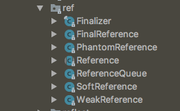
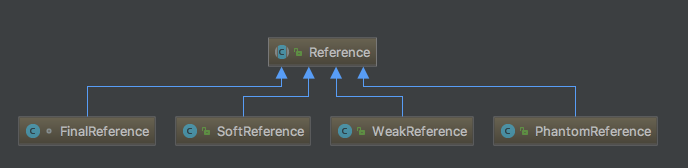

#Java 中的引用关系

参考文章
>http://www.cnblogs.com/skywang12345/p/3154474.html
>
>[Java Reference 源码分析](https://www.cnblogs.com/jabnih/p/6580665.html)
>
>[ReferenceQueue的使用](http://www.cnblogs.com/dreamroute/p/5029899.html)
>
>[VM源码分析之FinalReference完全解读](http://www.infoq.com/cn/articles/jvm-source-code-analysis-finalreference)
>
> [Java引用类型](http://www.importnew.com/20468.html)

Java 中 reference 相关类 java.lang.ref 包下面，

**Reference 是一个抽象类**，它定义了引用对象的通用操作。同包级别下还有 Reference 的四个子类，也就是 Java 中 4 种不同类型的引用。引用级别从高到低分别是：`FinalReference` `SoftReference`,`WeakReference`,`PhantomReference`

### SoftReference

> Soft reference objects, which are cleared at the discretion of the garbage collector in response to memory demand.  Soft references are most often usedto implement memory-sensitive caches.
>
> 软引用对象，由垃圾收集器根据内存需求自行清除。 软引用通常用于实现对内存敏感的缓存。