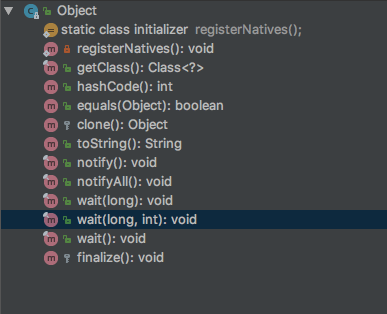

# Object

Object 应该是 Java 中最重要的一个类，没有之一。从 Object 类中可以引申出 大量知识点，包括垃圾收集、反射、线程等等十分重要的点。
## 综述

Object 的类结构



类对象是类层次结构的根。 **Object是所有类的超类(父类)**。 所有的对象，**包括数组**，都实现了这个类的方法。

 Object 中一共有12个方法。其中`registerNatives()`是唯一个静态方法，由 Object 中的静态代码块调用。其他 11 个都是实例方法。11 个实例方法中，被 final 修饰的方法有 6 个，包括 getClass() 方法和 5 个线程操作相关方法。

下面我们分别来看看其中的每一个方法。我们会将 线程相关的方法放到最后面。

## getClass()

````java
//返回运行时的 Class 对象，在反射中大量用到.
public final native Class<?> getClass();
````
另外两种获取 Class 对象的方式分别是 Class.forName() 和 类名.class

## hashCode()

````java
//返回该对象的哈希码值。该方法通常用在散列表上，例如HashMap、HashTable等数据结构上。
//
public native int hashCode();
````

对于 hashCode() 的 通用约定：

* 两个对象由 equal()方法判定相等，则两个对象的 hashcode() 方法结果必须相等。
* 两个对象，如果根据 equals()方法不相等，则hashcode() 方法并非必须不相等。应当尽可能让不同对象返回不同的 hashcode() 值（减少哈希碰撞），因为可以让提高散列表的性能。
* 在同一次 Java 程序的执行中，如果一个对象 equals()方法中用到的信息没有被修改，该对象多次调用hashcode() 方法返回的值应当是相同的。还是回到了，equals()判定相等，则 hashcode() 必须相等。

## equals()

````java
//判断两个对象是否相等。
public boolean equals(Object obj) {
    return (this == obj);
}
````

通常情况下，建议重写 equals()方法时，同时重写 hashcode() 方法，以保证 hashcode() 约定

## clone()

## toString()

````java
//一个类的文本表示，通常是为了更易于人类阅读，比如用在日志记录上。推荐所有的子类都重写此方法。
//默认是 该类的类名+‘@’+hashcode()的无符号十六进制表示形式
public String toString() {
    return getClass().getName() + "@" + Integer.toHexString(hashCode());
}
````

## finalize()

